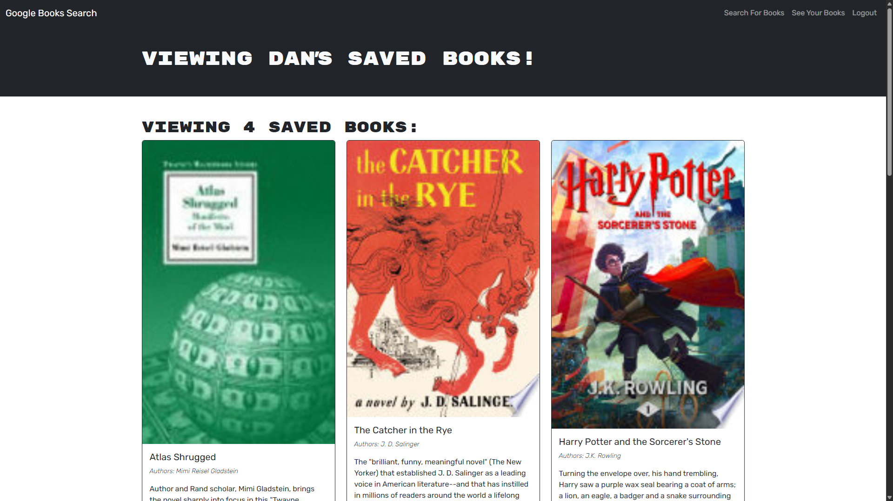

# GraphQLibrary

This app uses the Google Books API to a GraphQL API built with Apollo Server that stores your saved books in a cloud MongoBD. 

## Features
- **Book Search**: Allows users to search for books by title, author, or description through the Google Books API.
- **Save Books**: Users can save their favorite books to their account.
- **User Authentication**: Supports user sign-up, login, and session management.
- **View Saved Books**: Users can view and remove saved books from their personal collection.

## Table of Contents
 - [Installation](#installation)
 - [Usage](#usage)
 - [Credits](#credits)
 - [License](#license)
 - [Badges](#badges)
 - [Tests](#tests)
 - [Questions](#questions)

## [Installation](#installation)
  1. Clone this repo locally;
  2. Validate you have MongoDB installed locally; 
  3. Create a .env with `MONGODB_URI='mongodb://127.0.0.1:27017/googlebooks`;
  4. Add a secret to your .env as `JWT_SECRET_KEY=''`;
  5. Install dependencies by running `npm i` in your terminal from the root; 
  6. Run build with `npm run build`;
  7. Run dev with `npm run develop`;
  8. Your webrowser should open to ` http://localhost:3000/`; and
  9. See [Usage](#usage) for more details.

  ## [Usage](#usage)
  See live application here: [graphQLibrary on Render](https://graphqlibrary.onrender.com/). Note: it takes a moment to spin up each time with Render's free version. 
  1. Click `Login/Sign Up`
  2. Select `Sign Up` and enter Username, Email, and Password; 
  3. Login with your Email and password; 
  4. Enter a search and click `Submit Search`;
  5. Select `Save this Book!` for each book you'd like to save; 
  6. Continue searching until you've built your list;
  7. Click `See Your Books` in the Navbar to review your collection; 
  8. Click `Delete this Book!` for any books you'd like to remove; 
  9. When you're finished select `Logout`.
  
  ### Application Screenshot
  

  ## [Credits](#credits)
  - [Apollo GraphQL](https://www.apollographql.com/)
  - [bootstrap](https://getbootstrap.com/)
  - [bcrypt](https://www.npmjs.com/package/bcrypt)
  - [dotenv](https://www.npmjs.com/package/dotenv)
  - [express](https://expressjs.com/)
  - [Google Books API](https://developers.google.com/books)
  - [jsonwebtoken](https://jwt.io/)
  - [MongoDB](https://www.mongodb.com/)
  - [mongoose](https://mongoosejs.com/)
  - [React](https://react.dev/)
   - In Dev
      - [concurrently](https://www.npmjs.com/package/concurrently)
      - [nodemon](https://nodemon.io/)
      - [vite](https://vite.dev/)
  
  ## [License](#license)
  This project is licensed under the MIT - see the [LICENSE](LICENSE) file for details.

  ## [Badges](#badges)
  

  ## [Tests](#tests)
   Follow [Installation](#installation) and run application locally. Follow errors for tracing.
  
  ## [Questions](#questions)
  If you have any questions, please feel free to reach out to me at musserdn@gmail.com or visit my [GitHub Profile](https://github.com/musserdn/).